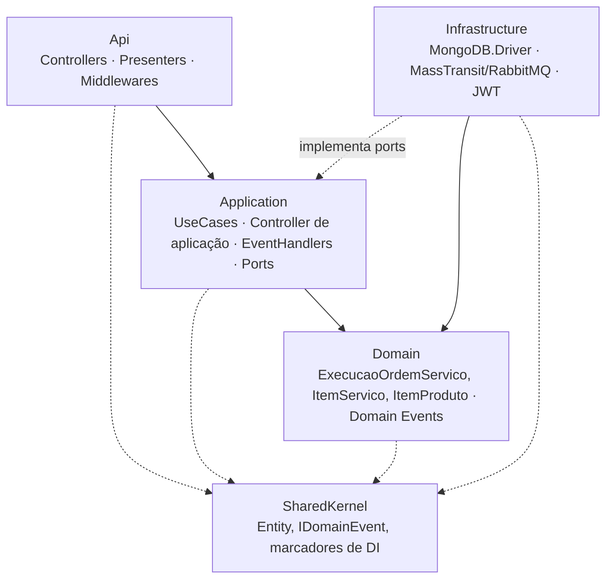
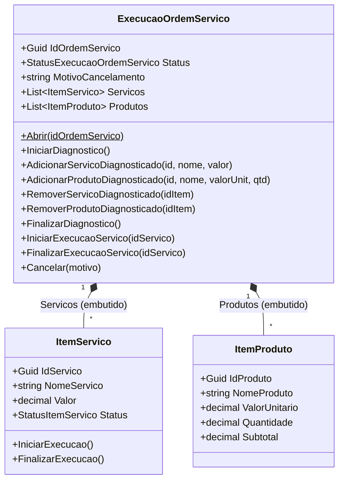
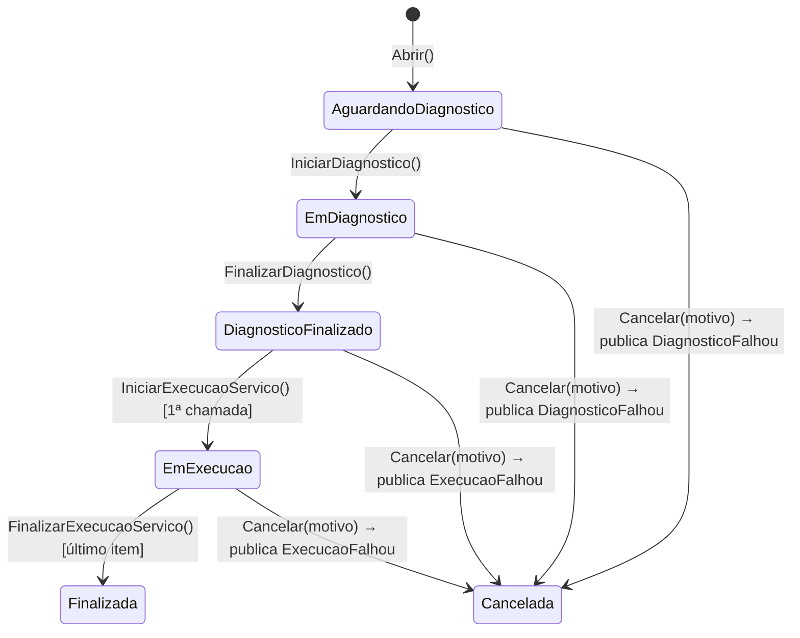
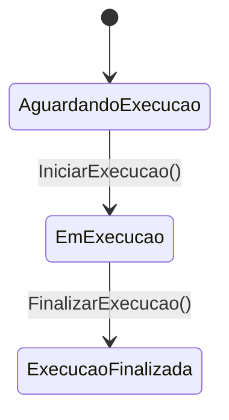
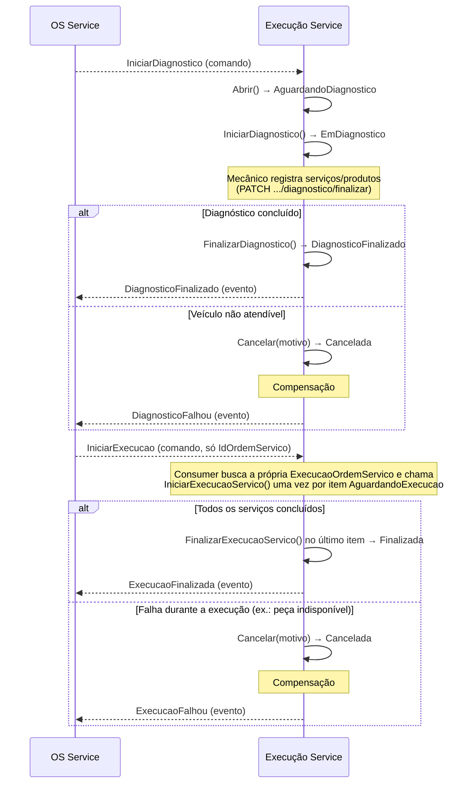

# Arquitetura — Execution Service

Documento complementar ao [README](../README.md), com mais profundidade sobre camadas,
modelo de domínio e persistência em MongoDB. Justificativa do desenho da saga como um
todo (por que a orquestração vive no OS Service): [ADR 0001 no repositório do OS
Service](https://github.com/monnclaro/soat-tech-challenge-os-service/blob/main/docs/adr/0001-saga-orquestrada-sem-state-machine-separado.md).

## Camadas (Clean Architecture)

Regra de dependência garantida por testes de arquitetura (NetArchTest,
`tests/Tests/Camadas`) — `Infrastructure` nunca é referenciada por `Application`/`Domain`.
Sem EF Core/DbContext: `MongoContext` é um wrapper fino sobre o driver oficial do
MongoDB, já que o banco é schemaless (sem migrations).

## Modelo de domínio

`ItemServico`/`ItemProduto` são **arrays embutidos no mesmo documento** MongoDB (não
coleções próprias) — ver README > "Por que MongoDB" para a justificativa completa.

### Máquina de estados

`Cancelar(motivo)` decide sozinho qual evento da saga publicar: se o status anterior
era `AguardandoDiagnostico`/`EmDiagnostico`, é uma falha de diagnóstico
(`DiagnosticoFalhou`); caso contrário, é uma falha de execução (`ExecucaoFalhou`) —
ver `PublicarExecucaoCanceladaHandler`.

### Máquina de estados de `ItemServico`

## Fluxo — diagnóstico e execução

## Mensageria — comandos e consumers

| Mensagem | Tipo | Direção | Consumer/Handler |
|---|---|---|---|
| `IniciarDiagnostico` | Comando | OS → Execução | `IniciarDiagnosticoConsumer` |
| `IniciarExecucao` | Comando | OS → Execução | `IniciarExecucaoConsumer` (itera os itens `AguardandoExecucao`) |
| `DiagnosticoFinalizado` | Evento | Execução → OS | — |
| `DiagnosticoFalhou` | Evento (compensação) | Execução → OS | — |
| `ExecucaoFinalizada` | Evento | Execução → OS | — |
| `ExecucaoFalhou` | Evento (compensação) | Execução → OS | — |

Publishers em `Infrastructure/Messaging/MassTransitSagaEventPublisher.cs`, reagindo a
domain events via `PublicarDiagnosticoFinalizadoHandler`/`PublicarExecucaoFinalizadaHandler`/
`PublicarExecucaoCanceladaHandler`. Contratos compartilhados (cópia idêntica nos 3
repos) em `Application/Messaging/Contracts/SagaContracts.cs`.

## Persistência (MongoDB)

Um documento por Ordem de Serviço (coleção `execucoes`), chaveado pelo próprio
`IdOrdemServico`. `ExecucaoOrdemServicoDocument` + `ExecucaoOrdemServicoMapper`
mantêm o `Domain` livre de qualquer dependência do driver MongoDB (`MongoDB.Bson`) —
ver README > "Persistência (MongoDB)" para a justificativa completa do documento de
persistência separado.

## Segurança

Nunca emite tokens — resource server puro, valida o JWT emitido pelo OS Service com
o mesmo segredo simétrico compartilhado.
